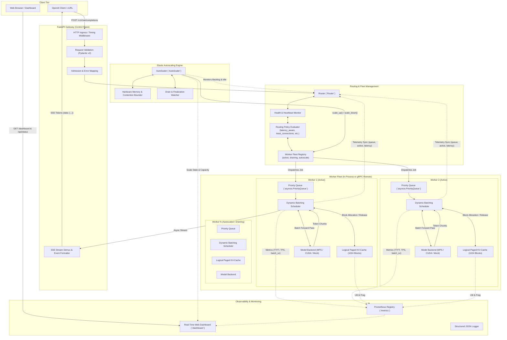
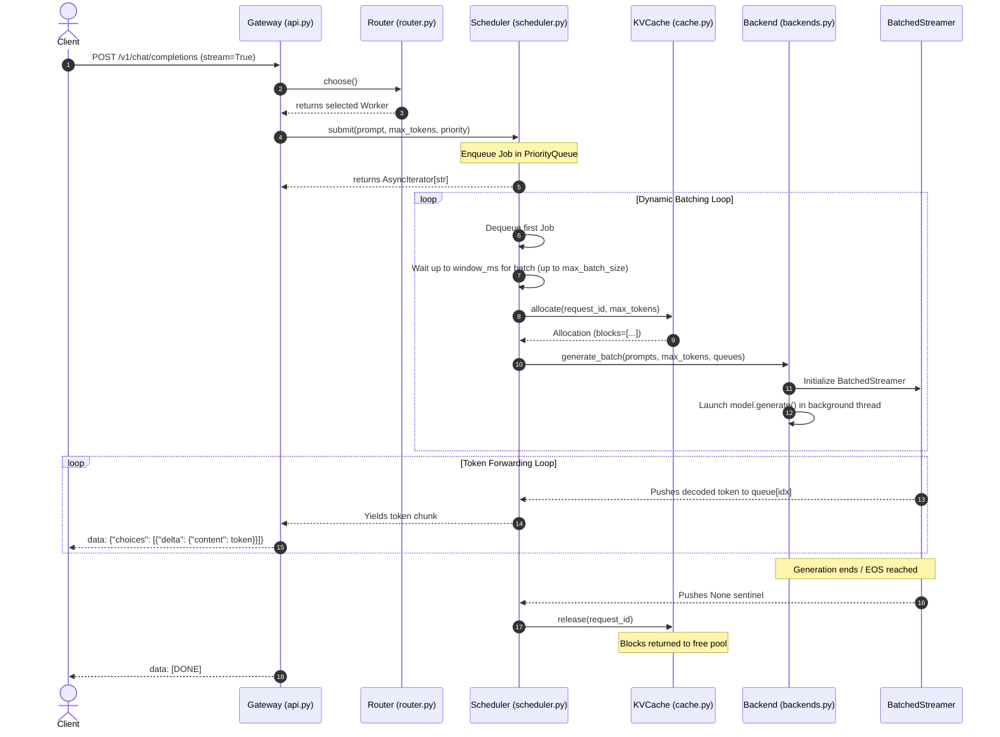

# Architecture & System Design

**Mini-Together (`mini-inference-engine`)** is an observable, fault-tolerant, high-throughput LLM inference serving engine and control plane. It provides an OpenAI-compatible API gateway, dynamic continuous batching, telemetry-aware load balancing, a logical paged KV-cache allocator, hardware-aware elastic autoscaling, multi-backend acceleration (NVIDIA CUDA, Apple Silicon MPS, and CPU), 4-bit/8-bit quantization, and a built-in real-time telemetry dashboard.

---

## 1. Architectural Principles

Mini-Together is built on six core design principles:

1. **Separation of Control Plane & Compute**: The API gateway owns HTTP protocol translation, request validation, admission control, and router telemetry. Workers independently manage their priority queues, dynamic batching windows, logical KV-cache blocks, and backend hardware execution.
2. **Telemetry-Driven Dynamic Balancing**: Load distribution avoids static round-robin heuristics. The router continuously synchronizes live queue depths, active in-flight sequence counts, and rolling latencies from worker schedulers to compute expected wait times.
3. **Dynamic Batching with Concurrent Token Streaming**: Requests arriving within a configurable batching window are coalesced into a single forward execution step on the hardware backend, while a thread-safe streamer demultiplexes tokens asynchronously to client streams.
4. **Paged Memory Modeling & Backpressure**: A logical paged KV-cache tracks sequence block allocations, memory utilization, fragmentation, and LRU eviction pressure, preventing unconstrained memory growth and signaling structured backpressure before out-of-memory (OOM) errors occur.
5. **Hardware-Aware Elastic Autoscaling**: Autonomous worker pool scaling that dynamically calculates safe worker limits based on physical hardware memory (CUDA VRAM or Apple Silicon unified RAM), model precision, and device contention caps.
6. **Fail-Fast Admission & Clean Error Taxonomy**: Cluster saturation and queue exhaustion are rejected immediately with standard HTTP `429 Too Many Requests` (including `Retry-After`) and `503 Service Unavailable`, preventing cascading thread pool exhaustion.

---

## 2. High-Level System Architecture

The following diagram illustrates the end-to-end request flow across the control plane, worker schedulers, memory management, autoscaling, model backends, and observability subsystems:



---

## 3. Core Architectural Subsystems

### 3.1 API Gateway & Admission Layer

The gateway layer ([`api.py`](file:///Users/hkarimkonda/Documents/mini-inference-engine/src/mini_inference_engine/api.py)) provides OpenAI API compatibility and coordinates request lifecycles.

- **Endpoint Surface**:
  - `POST /v1/chat/completions`: Chat completions supporting multi-turn conversation lists (`messages`) and OpenAI-standard streaming chunks (`chat.completion.chunk`).
  - `POST /v1/completions`: Raw prompt text completions (`text_completion.chunk`).
  - `GET /v1/models`: OpenAI-compatible model discovery endpoint.
  - `GET /dashboard` & `GET /`: Zero-dependency, single-page real-time monitoring interface.
  - `GET /api/status`: Cluster telemetry JSON (model, device, active workers, live TPS, cache utilization, autoscaler state).
  - `GET /health`: Cluster health status (OK if at least one worker is alive).
  - `GET /metrics`: Standard Prometheus metrics export.
- **Request Timing Middleware**:
  An asynchronous HTTP middleware wraps the response `body_iterator`. This guarantees that streaming requests measure latency until the final token is sent, rather than prematurely completing when headers are flushed.
- **Admission Control & Error Taxonomy**:
  The gateway catches typed exceptions and maps them to structured HTTP status codes:
  - [`AdmissionError`](file:///Users/hkarimkonda/Documents/mini-inference-engine/src/mini_inference_engine/errors.py) &rarr; **HTTP 429 Too Many Requests** with `Retry-After: 1` and `{"error": {"type": "rate_limit_exceeded"}}`.
  - [`NoHealthyWorkers`](file:///Users/hkarimkonda/Documents/mini-inference-engine/src/mini_inference_engine/errors.py) &rarr; **HTTP 503 Service Unavailable** with `{"error": {"type": "service_unavailable"}}`.
  - Model mismatch &rarr; **HTTP 404 Not Found**.
  - Token limit exceeded (`max_tokens > MINI_MAX_TOKENS`) &rarr; **HTTP 400 Bad Request**.
- **Client Disconnection Safety**:
  During server-sent event (SSE) token generation, the gateway checks `await request.is_disconnected()`. If a client aborts, the output generator terminates, which triggers the scheduler iterator's `finally` block to cancel the job and release KV-cache memory immediately.

---

### 3.2 Telemetry-Aware Router & Fleet Management

The router ([`router.py`](file:///Users/hkarimkonda/Documents/mini-inference-engine/src/mini_inference_engine/router.py)) evaluates worker health and assigns requests to the optimal worker.

#### Worker Fleet State
Each worker is tracked via the [`Worker`](file:///Users/hkarimkonda/Documents/mini-inference-engine/src/mini_inference_engine/router.py#L12-L20) dataclass:
- `worker_id`: Unique identifier (e.g. `worker-1`, `worker-2`).
- `scheduler`: Reference to the worker's scheduler (in-process or remote gRPC stub).
- `healthy`: Boolean health flag based on heartbeat recency.
- `active`: Number of sequences currently generating tokens.
- `queue_depth`: Number of jobs waiting in the admission queue.
- `latency`: Rolling average execution latency (seconds).
- `draining`: Boolean flag indicating whether the worker is gracefully shutting down.
- `last_heartbeat`: Timestamp of the latest health heartbeat.

#### Telemetry Synchronization
In [`Router.refresh_health()`](file:///Users/hkarimkonda/Documents/mini-inference-engine/src/mini_inference_engine/router.py#L51-L68), the router synchronizes live metrics directly from each worker's scheduler:
```python
if hasattr(worker.scheduler, "queue_depth"):
    worker.queue_depth = worker.scheduler.queue_depth
if hasattr(worker.scheduler, "active_count"):
    worker.active = worker.scheduler.active_count
if hasattr(worker.scheduler, "avg_latency"):
    worker.latency = worker.scheduler.avg_latency
```

#### Routing Policies (`MINI_ROUTING_POLICY`)
1. **`round_robin`**: Standard round-robin distributing requests sequentially across healthy, non-draining workers using an incrementing cursor.
2. **`least_connections`**: Dispatches to the worker with the lowest in-flight generation count (`min(healthy, key=lambda w: w.active)`).
3. **`least_queue_length`**: Dispatches to the worker with the shortest waiting queue backlog (`min(healthy, key=lambda w: w.queue_depth)`).
4. **`latency_aware` (Default)**: Dynamic backlog-balanced delay minimization. Rather than sorting lexicographically, the router scores workers using expected wait time:
   $$\text{Score} = (\text{queue\_depth} + \text{active} + 1) \times \text{latency}$$
   This balances load proportionally: a slightly faster worker will receive more traffic, but if its queue builds up, traffic immediately shifts to idle workers to prevent queue starvation.

#### Fleet Scaling & Graceful Draining
The router exposes primitives for elastic membership management:
- [`add_worker(worker)`](file:///Users/hkarimkonda/Documents/mini-inference-engine/src/mini_inference_engine/router.py#L28-L33): Registers a newly provisioned worker into the active pool.
- [`mark_draining(worker_id)`](file:///Users/hkarimkonda/Documents/mini-inference-engine/src/mini_inference_engine/router.py#L35-L41): Flags an active worker as draining. Draining workers finish in-flight jobs, but are excluded from `Router.choose()`.
- [`remove_worker(worker_id)`](file:///Users/hkarimkonda/Documents/mini-inference-engine/src/mini_inference_engine/router.py#L43-L49): Unregisters a drained worker completely after queue depth and active connections hit zero.
- **Heartbeat Expiration**: Workers with heartbeat silence exceeding `MINI_HEARTBEAT_TIMEOUT_S` are marked unhealthy and excluded from routing.

---

### 3.3 Hardware-Aware Elastic Autoscaling Engine

The autoscaler ([`autoscaler.py`](file:///Users/hkarimkonda/Documents/mini-inference-engine/src/mini_inference_engine/autoscaler.py)) autonomously adjusts worker pool sizes in response to real-time cluster demand while respecting host hardware constraints.

```
Incoming Request Spike
        │
        ▼
   Total Backlog >= Scale-Up Threshold
        │
        ▼
   Hardware Memory Check: (Current Workers < Max Safe Workers?)
       ├── YES ──► Scale Up: Instantiate Worker, Warm Scheduler, Register in Router
       └── NO  ──► Saturated: Preserve Stability, Backpressure via HTTP 429
```

#### 1. Hardware Memory Estimation & Contention Bounds
Before provisioning workers, the engine calculates safe bounds via `compute_safe_worker_bounds()`:
- **Model Footprint Estimation** (`estimate_model_memory_gb`):
  Parses model parameter counts (e.g. 0.5B, 3B, 7B) and applies bytes-per-parameter factors based on quantization precision:
  $$\text{Bytes/Param} = \begin{cases} 0.65 & \text{for 4-bit (NF4 + metadata)} \\ 1.15 & \text{for 8-bit} \\ 2.00 & \text{for FP16 / BF16} \\ 4.00 & \text{for FP32} \end{cases}$$
- **Host Memory Headroom** (`get_usable_memory_gb`):
  - **CUDA**: Reads GPU device memory via `torch.cuda.get_device_properties` reserving a 2.0 GB OS/driver margin.
  - **Apple Silicon / CPU**: Queries system RAM via `psutil.virtual_memory` reserving 4.0 GB for macOS display and OS subsystems.
- **Device Contention Cap**:
  On shared unified memory (Apple Silicon Metal MPS) or single GPU environments, worker pools are capped (typically 4 workers on MPS, 8 on CUDA) to prevent GPU command buffer thrashing and context switching overhead.

#### 2. Scaling State Machine
An asynchronous evaluation loop (`AutoScaler._loop`) checks cluster state every `eval_interval_s`:
- **Scale-Up Condition**:
  Triggered when total queue backlog $\ge \text{scale\_up\_threshold} \times \text{total\_workers}$ (or $\ge 4$) and current pool $<$ `max_workers`. Spawns a new worker with fresh scheduler and KV cache, then inserts it into the router. Enforces a 4.0-second cooldown period between scale operations.
- **Scale-Down Condition**:
  Triggered when total backlog is zero and active load $\le \max(1, \text{total\_workers} - 1)$ for sustained idle duration $\ge \text{scale\_down\_idle\_s}$ (e.g. 20s). The autoscaler selects the least-utilized worker, marks it for draining, monitors its queue drain to zero, and stops its scheduler.

---

### 3.4 Scheduler & Dynamic Batching Engine

The scheduler ([`scheduler.py`](file:///Users/hkarimkonda/Documents/mini-inference-engine/src/mini_inference_engine/scheduler.py)) handles queueing, batch assembly, and streaming demultiplexing.



#### Dynamic Batch Gathering
1. **Priority Queue**: Requests enter a bounded `asyncio.PriorityQueue[Job]`. Jobs are sorted by `(priority, created)` to ensure strict FIFO ordering among equal-priority requests while allowing urgent requests to bypass the queue.
2. **Time-Slotted Batching Window**: The scheduler pulls the head job, then checks for additional queued jobs until either `max_batch_size` is reached or the batch deadline (`time.monotonic() + window_ms / 1000`) expires.
3. **Queue Wait Observation**: Time spent in the queue is observed via the `QUEUE_WAIT` Prometheus histogram.

#### Concurrent Multi-Sequence Streaming
When running dynamic batching:
- Individual `asyncio.Queue` instances are created for each job in the batch.
- An asynchronous `forward_stream` task is spawned for every admitted job.
- On the very first token emitted for each sequence, Time-To-First-Token is measured and recorded to the `TTFT` metric.
- When an individual sequence completes (or encounters an EOS token), its queue receives a `None` sentinel, its KV-cache allocation is released, and its completion latency is added to the rolling average.

---

### 3.5 Logical Paged KV-Cache Manager

The cache manager ([`cache.py`](file:///Users/hkarimkonda/Documents/mini-inference-engine/src/mini_inference_engine/cache.py)) models paged sequence memory allocation without coupling to specific GPU tensor memory formats.

```
Total Memory Pool: 1024 Blocks (16 Tokens / Block = 16,384 Token Total Capacity)
┌──────────────┬──────────────┬──────────────┬──────────────┬──────────────┐
│   Block 0    │   Block 1    │   Block 2    │   Block 3    │   Block 4    │
│  [Req A: 1]  │  [Req A: 2]  │  [Req B: 1]  │    [FREE]    │  [Req B: 2]  │
└──────────────┴──────────────┴──────────────┴──────────────┴──────────────┘
                                                  ▲
                                                  │
                 LRU Eviction (Idle Table) ◄──────┴──────► Free Set
```

#### Allocation Mechanics
- **Block Calculation**: For a request requiring $N$ tokens with block size $B$ (default: 16):
  $$\text{Blocks Required} = \max\left(1, \left\lceil \frac{N}{B} \right\rceil\right)$$
- **Allocation Routine**: Blocks are assigned from the `self.free` set.
- **LRU Eviction**: If free blocks are insufficient, the allocator evicts allocations registered in `self.idle` in least-recently-used order.
- **Backpressure**: If both `free` blocks and `idle` sequences cannot satisfy the requested allocation, the allocator raises [`CachePressure`](file:///Users/hkarimkonda/Documents/mini-inference-engine/src/mini_inference_engine/errors.py). The scheduler catches this, cancels the job, and emits a structured runtime error.

#### Memory Telemetry
- **Utilization**: Ratio of assigned blocks to total capacity:
  $$\text{Utilization} = \frac{\text{capacity} - |\text{free}|}{\text{capacity}}$$
- **Fragmentation**: Evaluates contiguous block runs in the free set to detect non-contiguous allocation patterns:
  $$\text{Fragmentation} = 1.0 - \frac{\text{length of largest contiguous free run}}{\max(1, |\text{free}|)}$$

---

### 3.6 Model Execution Backends

The backend layer ([`backends.py`](file:///Users/hkarimkonda/Documents/mini-inference-engine/src/mini_inference_engine/backends.py)) abstracts physical model execution.

#### 1. Transformers Backend (`TransformersBackend`)
- **Device Support**: Automatically configures PyTorch compute devices:
  - **NVIDIA CUDA**: Selects `bfloat16` (if supported) or `float16`.
  - **Apple Silicon MPS**: Uses Metal Performance Shaders with `float16`.
  - **CPU**: Fallback using `float32`.
- **Shared In-Process Weights**: In single-node deployments, workers share a single model instance in memory, eliminating redundant VRAM consumption.
- **Custom `BatchedStreamer`**: Implements Hugging Face's `BaseStreamer` interface. When `model.generate()` produces token tensors in a background thread, the streamer decodes each sequence's token ID and safely enqueues the text into the corresponding asyncio queue using `loop.call_soon_threadsafe`.
- **Quantization Integration**:
  Configurable via `MINI_QUANTIZATION`:
  - `4bit`: Loads models using `BitsAndBytesConfig(load_in_4bit=True, bnb_4bit_quant_type="nf4", bnb_4bit_compute_dtype=dtype)`. Enables serving models like `Qwen/Qwen2.5-3B-Instruct` in ~2.2 GB VRAM on consumer laptops.
  - `8bit`: Loads models using `load_in_8bit=True`.
- **Hardware Abort Safety**:
  When a streaming request is aborted mid-flight by a client disconnect, the backend ensures the generation thread cleanly completes and joins before releasing the execution lock. This prevents race conditions in underlying drivers (such as Apple Silicon Metal buffer collisions).

#### 2. Mock Backend (`MockBackend`)
- Deterministic token generator producing parameterized text streams with configurable per-token delays (`delay=0.002s`).
- Used for unit testing, queue stress testing, CI pipelines, and benchmarking scheduler/router overhead without requiring GPU hardware.

---

### 3.7 Real-Time Telemetry & Observability

Observability is a first-class citizen across all layers:

1. **Integrated Web Dashboard** ([`dashboard.py`](file:///Users/hkarimkonda/Documents/mini-inference-engine/src/mini_inference_engine/dashboard.py)):
   - Served directly from `/dashboard` and `/`.
   - Zero external CSS/JS libraries (vanilla HTML5/CSS3/ES6).
   - Real-time speedometer displaying cluster throughput (`tok/s`).
   - Detailed worker telemetry cards showing status, active sequences, queue depths, and average latency.
   - Paged KV-cache utilization bar and fragmentation gauge.
   - Live SSE testing playground with preconfigured prompts (Math, Quantum, Joke, Code).
2. **Prometheus Metrics Surface** ([`metrics.py`](file:///Users/hkarimkonda/Documents/mini-inference-engine/src/mini_inference_engine/metrics.py)):
   - `mini_requests_total`: Total requests counter labeled by endpoint and status.
   - `mini_request_duration_seconds`: Histogram of end-to-end request latency.
   - `mini_time_to_first_token_seconds`: Histogram of TTFT.
   - `mini_queue_wait_seconds`: Histogram of scheduler queue wait times.
   - `mini_batch_size`: Dynamic batch size distribution histogram.
   - `mini_tokens_total`: Total tokens generated counter.
   - `mini_tokens_per_second`: Live gauge computed across a rolling window.
   - `mini_cache_utilization` & `mini_cache_fragmentation`: Gauges reflecting memory state.
   - `mini_worker_health` & `mini_worker_load`: Cluster load balancing status.
3. **Structured Logging** ([`log.py`](file:///Users/hkarimkonda/Documents/mini-inference-engine/src/mini_inference_engine/log.py)):
   - Context-enriched logging tracking request IDs, HTTP status codes, durations, queue depths, and worker identifiers.

---

### 3.8 RPC & Inter-Process Communication Boundary

The engine defines a versioned gRPC contract in [`protocol.proto`](file:///Users/hkarimkonda/Documents/mini-inference-engine/src/mini_inference_engine/protocol.proto):

```protobuf
syntax = "proto3";
package mini.v1;

service Worker {
  rpc Register(RegisterRequest) returns (RegisterResponse);
  rpc Heartbeat(HeartbeatRequest) returns (HeartbeatResponse);
  rpc Generate(GenerateRequest) returns (stream Token);
  rpc Cancel(CancelRequest) returns (CancelResponse);
  rpc Drain(DrainRequest) returns (DrainResponse);
}

message RegisterRequest { string worker_id = 1; string model = 2; }
message RegisterResponse { bool accepted = 1; }
message HeartbeatRequest { string worker_id = 1; uint32 active = 2; uint32 queue_depth = 3; }
message HeartbeatResponse { bool healthy = 1; }
message GenerateRequest { string request_id = 1; string prompt = 2; uint32 max_tokens = 3; int32 priority = 4; }
message Token { string request_id = 1; string text = 2; bool done = 3; string error = 4; }
message CancelRequest { string request_id = 1; }
message CancelResponse { bool cancelled = 1; }
message DrainRequest { bool graceful = 1; }
message DrainResponse { bool draining = 1; }
```

#### Deployment Topologies
- **In-Process Mode (Default)**: Worker instances run inside the gateway Python process. Schedulers and backends communicate via async queues. Zero network latency, zero compilation overhead, ideal for local testing on macOS / Apple Silicon.
- **Distributed Mode (gRPC)**: Workers run as independent containerized processes (e.g. across separate GPU nodes or Modal serverless containers). The gateway communicates with workers via `WorkerClient` stubs, honoring identical scheduling, heartbeat, and cancellation semantics.

---

## 4. Configuration Matrix

All configuration parameters are defined in [`Settings`](file:///Users/hkarimkonda/Documents/mini-inference-engine/src/mini_inference_engine/config.py) and read from environment variables:

| Environment Variable | Default | Type | Description |
| :--- | :--- | :--- | :--- |
| `MINI_MODEL` | `mock` | `str` | Model identifier (`mock` or Hugging Face model path, e.g. `Qwen/Qwen2.5-3B-Instruct`). |
| `MINI_DEVICE` | `auto` | `str` | Compute target device (`auto`, `cuda`, `mps`, or `cpu`). |
| `MINI_QUANTIZATION` | `none` | `str` | Weight quantization mode (`none`, `4bit`, `8bit`). |
| `MINI_ROUTING_POLICY` | `latency_aware` | `str` | Load balancing policy (`latency_aware`, `least_connections`, `least_queue_length`, `round_robin`). |
| `MINI_MAX_BATCH_SIZE` | `8` | `int` | Maximum number of concurrent sequences combined into a single batch forward pass. |
| `MINI_BATCH_WINDOW_MS` | `8` | `int` | Maximum duration (milliseconds) the scheduler waits to coalesce requests into a batch. |
| `MINI_MAX_QUEUE_SIZE` | `256` | `int` | Maximum jobs permitted in each worker's admission queue before returning HTTP 429. |
| `MINI_CACHE_BLOCKS` | `1024` | `int` | Total capacity of the logical KV-cache block pool. |
| `MINI_CACHE_BLOCK_TOKENS` | `16` | `int` | Number of tokens represented by a single logical cache block. |
| `MINI_MAX_TOKENS` | `2048` | `int` | Hard upper limit on output generation tokens per request. |
| `MINI_HEARTBEAT_TIMEOUT_S`| `5.0` | `float` | Heartbeat silence duration after which a worker is marked unhealthy. |
| `MINI_AUTOSCALE_ENABLED` | `True` | `bool` | Enables autonomous worker scaling and draining evaluation. |
| `MINI_MIN_WORKERS` | `1` | `int` | Minimum worker pool floor for the autoscaler. |
| `MINI_MAX_WORKERS` | `0` | `int` | Maximum worker pool ceiling (0 auto-detects based on hardware VRAM/RAM). |
| `MINI_SCALE_UP_THRESHOLD`| `3` | `int` | Average queue backlog threshold per worker triggering scale-up. |
| `MINI_SCALE_DOWN_IDLE_S` | `20.0` | `float` | Idle duration before an inactive worker is marked for draining. |

---

## 5. Summary

The architecture of **Mini-Together** unifies clean control-plane abstractions with high-performance model serving patterns:
- **FastAPI Gateway** guarantees standard OpenAI contract compliance and admission defense.
- **Latency-Aware Router** dynamically load balances requests using real scheduler telemetry.
- **Hardware-Aware Autoscaler** dynamically provisions and drains workers within safe hardware memory envelopes.
- **Dynamic Batching Scheduler** delivers high throughput via coalesced forward passes and parallel token streaming.
- **Paged KV-Cache** provides structured memory allocation tracking and backpressure defense.
- **Quantized Transformers Backend** maximizes hardware efficiency across Apple Silicon MPS and NVIDIA CUDA GPUs.
- **Built-in Dashboard & Prometheus Metrics** provide complete operational transparency.
